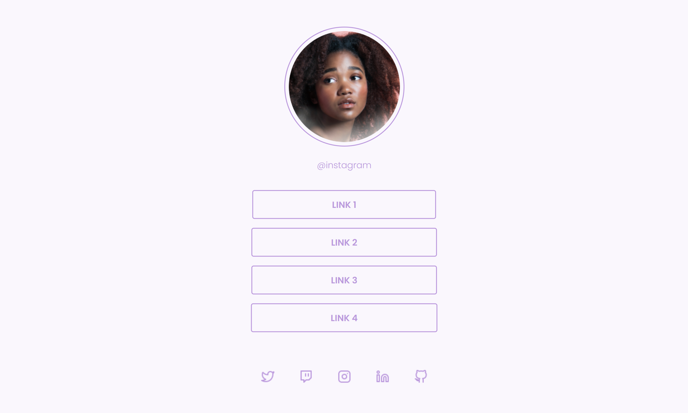

# Social Tree

## Projeto 💻
Projeto de um desafio da Rocketseat de criar uma página com uma lista de links que pode ser usada em perfis de redes sociais.  
(https://www.figma.com/file/zz8QxNrvfZxVr6xxQeQ8yj/DD-%2F-Social-links-(Copy)?t=IcxEa5MMqiZlpKuA-6)

## Tecnologias 🚀
As tecnologias utilizadas neste projeto são:
- HTML
- CSS
- JavaScript
- React
- React DOM

## Créditos ❤️
Feito por [Millene Eduarda Ishiyama](https://github.com/miishiyama/).
